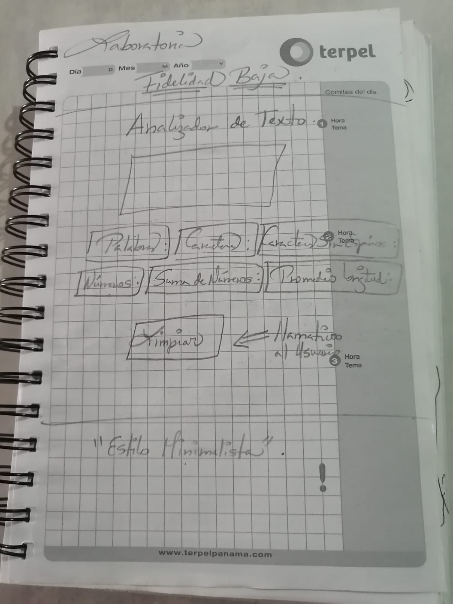

# Analizador de texto

## Índice

* [1. Descripción general del proyecto](#1-descripcion-general)
* [2. Conoce a que usuario va dirigido](#2-usuario-final)
* [3. Características principales](#3-características-principales)
* [4. Modo de uso](#4-uso)
* [5. Prototipo de baja fidelidad](#5-prototipo-fidelidad)

***

## 1. Descripción general del proyecto

* Un analizador de texto es una aplicación para extraer información útil de un texto utilizando diversas técnicas, como el procesamiento del lenguaje natural (NLP), el aprendizaje automático (ML) y el análisis estadístico. Estas aplicaciones pueden proporcionar una variedad de métricas que brindan información básica sobre la longitud y la estructura del texto como por ejemplo, el conteo de palabras, el conteo de caracteres, el conteo de oraciones y el conteo de párrafos. Otras métricas incluyen el análisis de sentimientos, que utiliza técnicas de NLP para determinar el tono general positivo, negativo o neutral del texto, y el análisis de legibilidad, que utiliza algoritmos para evaluar la complejidad y la legibilidad del texto.
*En general, las aplicaciones de análisis de texto brindan información valiosa y métricas sobre los textos que pueden ayudar a las usuarias a tomar decisiones informadas y sacar conclusiones significativas. Mediante el uso de estas herramientas de análisis, las usuarias pueden obtener una comprensión más profunda de los textos.

## 2. Conoce a que usuario va dirigido

*Este proyecto es un analizador de texto diseñado para ayudar a estudiantes y académicos a comprender y analizar textos de manera más eficiente. Proporciona una variedad de herramientas y métricas que pueden ser útiles en diferentes contextos académicos.

## 3. Características principales

*Recuento de palabras: Obtenga el número total de palabras en un texto.
*Recuento de caracteres: Obtenga el total de caracteres en un texto.
*Recuento de caracteres excluyendo espacios y signos de puntuación: Obtenga el total de caracteres en un texto, excluyendo espacios y signos de puntuación.
*Recuento de números: Obtenga el total de números en un texto.
*Suma total de números: Obtenga la suma total de los números en el texto.
*Longitud media de las palabras: Obtenga el promedio de palabras en un texto.

## 4. Modo de uso

1. Cargar el texto: Copie y pegue el texto que desea analizar en el área de entrada del analizador.

2. Explorar resultados: Revise los resultados proporcionados por el analizador y utilícelos para mejorar su comprensión del texto.

3. Seleccione Botón Limpiar Métricas: Al darle click al botón puede analizar un texto nuevamente.

## 5. Prototipo de baja fidelidad

